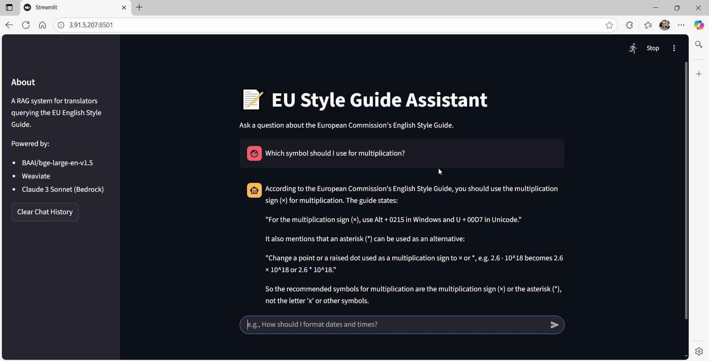

# From PDF to Precise Answers: A RAG Knowledge Assistant for Translators

[](https://youtu.be/WarXeIrMPQI)

---

## **Overview**

In this project, I present a **Retrieval-Augmented Generation (RAG)** system designed to assist translators and project managers working with style guides.  
The current version allows users to query the **European Commission’s English Style Guide** and instantly receive precise, grounded answers, eliminating the need for manual searches.

The application integrates **Weaviate**, **Amazon Bedrock (Claude 3 Sonnet)**, and **Streamlit** in a full end-to-end pipeline covering document parsing, embedding, retrieval, and LLM response generation.  

It was containerized with **Docker** and deployed on **AWS EC2** for demonstration purposes. Click the image above to watch the full demonstration. The live AWS deployment has been discontinued to manage costs.

---

## **Key Features**

- **Answers** complex style-related **questions** directly from the official guide.  
- Leverages **hybrid semantic–keyword retrieval** for high precision.  
- Uses **prompt-engineered** LLM generation to minimize hallucinations.  
- Deploys consistently with **Docker** for containerized architecture
- Allows **easy integration** of new sources: terminology databases, translation memories, or domain-specific style rules.

---

## **Use Cases**

- **Translator Efficiency:** Get quick, reliable answers to style questions, eliminating manual search time and increasing translation speed.
- **Project Consistency:** Maintain consistent terminology and formatting across documents and languages.
- **Onboarding & Training:** Help new translators learn institutional style rules through direct, interactive access.
- **Quality Assurance:** Support editors and project managers in checking compliance with official style standards.

---

## **RAG Pipeline Overview**

The system implements a **RAG workflow** to ensure accurate, grounded answers:

<p align="center">
  
</p>


| Stage                               | Description                                                                                                                                                                                                                                                     |
| ----------------------------------- | ------------------------------------------------------------------------------------------------------------------------------------------------------------------------------------------------------------------------------ |
| **1. Document Parsing**             | Extracts text from the European Commission’s *English Style Guide* using **`PyMuPDF`**, cleaning layout noise such as headers, footers, and page numbers.                                                               |
| **2. Chunking**                     | Splits the text into coherent chunks aligned with the document’s structure (parts, chapters, sections, subsections).                                                                   |
| **3. Embedding Generation**         | Converts each chunk into dense vectors using **`BAAI/bge-large-en-v1.5`**, capturing semantic meaning for retrieval.                                                                      |
| **4. Vector Storage & Indexing**    | Stores embeddings and metadata in **Weaviate**, supporting semantic, keyword, and hybrid searches.                                                                       |
| **5. Query Processing & Retrieval** | Through the **Streamlit** interface, the user submits a query, which is embedded and matched against stored vectors using **hybrid search** (`α = 0.7`) to retrieve the most relevant chunks.                      |
| **6. Prompt Construction**          | Retrieved context is combined into a structured prompt that defines task scope, enforces factual grounding, and prevents out-of-context answers.                                                                        |
| **7. LLM Response Generation**      | The Streamlit app sends the prompt to **Claude 3 Sonnet** via **Amazon Bedrock**, generates the final grounded answer, and displays **performance metrics** (retrieval time, LLM latency, and total response time). |

---

## **Repository Structure**

```

knowledge-assistant/
│
├── app/                              # Streamlit application logic
│   ├── app.py                        # Main UI and chat-based interaction with the RAG backend
│   ├── ingest_data.py                # Weaviate ingestion and embedding initialization
│   └── .streamlit/config.toml        # Streamlit layout configuration
│
├── data/                             # Datasets and source documents
│   ├── raw/                          # Source PDF (EU English Style Guide)
│   ├── processed/                    # Cleaned and chunked text data
│   └── evaluation/ground_truth.json  # Ground truth Q&A pairs for benchmarking
│
├── figures/                          # Images and diagrams for the README
│   ├── knowledge_assistant.png       # App demo screenshot (linked to YouTube)
│   └── rag_workflow.svg              # System architecture diagram
│
├── notebooks/                        # Full analysis and experiment documentation
│   ├── 01_data_exploration_and_preprocessing.ipynb
│   ├── 02_embedding_and_vectordb_setup.ipynb
│   ├── 03_chunking_and_retrieval_evaluation.ipynb
│   └── 04_rag_implementation_and_prompt_engineering.ipynb
│
├── results/                                # Evaluation outputs and model comparison results
│   ├── retrieval_evaluation_results.json   # Results from chunking and search strategy evaluation
│   └── rag_evaluation_results.json         # Prompt engineering and hallucination evaluation
│
├── Dockerfile                        # Defines the Docker image for local deployment of the RAG app
├── docker-compose.yml                # Launches Weaviate and Streamlit services
├── config.yaml                       # Specifies embedding model, Weaviate, and Bedrock LLM settings
├── requirements.txt                  # Python dependencies for the RAG pipeline
└── .env.example                      # Template for AWS and Weaviate connection settings

```

---

## **Evaluation Setup**

To build a high-performing RAG system, I tested key design choices:

* **Chunking strategies:** Compared **section-based** chunking (preserving document hierarchy) against **fixed-size** chunking (baseline)
* **Retrieval methods:** Evaluated pure keyword search (BM25), pure semantic (vector) search, and hybrid search with different parameters (α = 0.3 and 0.7)
* **Prompt design:** Tested a **basic prompt** against an **engineered prompt** that included role definition, strict grounding rules, and fallback handling for out-of-scope queries.

---

## **Key Findings**

### **Chunking Strategy Comparison**
- **Section-based chunks** outperformed fixed-size chunks by **33%** in F1-score.  
- Preserving the document’s **hierarchical structure** (Parts → Chapters → Sections) improved retrieval quality.  

### **Search Method Analysis**
- **Hybrid search (α = 0.7)** achieved the best performance, with an **F1-score of 0.733**.
- It outperformed both **BM25** and **pure vector search**, indicating that the right mix of semantic and keyword matching improves overall retrieval quality.

### **Prompt Engineering Impact**
- The engineered prompt achieved 100% factual grounding (0% hallucination) across all 10 evaluated queries, including out-of-scope edge cases.
- **Prompting strategies** like role definition, explicit instructions, and fallback handling prevented unsupported answers.

### **Overall System Performance**
- **37.3% overall improvement** from baseline to optimized system.
- Successfully handled **edge cases**, including queries outside the scope of the source document.

---

## **Technical Stack**

| Category                | Tools                                                                        |
| ------------------------| -----------------------------------------------------------------------------|
| **Data Handling**       | PyMuPDF, tiktoken                                                            |
| **Embeddings Model**    | `BAAI/bge-large-en-v1.5` (Hugging Face)                                      |
| **Vector Database**     | Weaviate                                                                     |
| **LLM**                 | Claude 3 Sonnet via Amazon Bedrock                                           |
| **Web Framework**       | Streamlit                                                                    |
| **Containerization**    | Docker, Docker Compose                                                       |
| **Cloud Deployment**    | AWS EC2 (temporary demo deployment)                                          |
| **Evaluation**          | Custom ground truth dataset & Weighted metrics (Precision, Recall, F1-score) |

---

## **How to Run Locally**

### **1. Clone the repo**
```bash
git clone https://github.com/MathRC/knowledge-assistant.git
cd knowledge-assistant
```

### **2. Set up the environment**

Create a `.env` file based on `.env.example` to define your AWS credentials and Weaviate settings.

### **3. Run with Docker**

```bash
docker-compose up --build
```

This will:

- Start a **Weaviate** vector database instance locally
- Build the **app container**
- Launch the **Streamlit** interface

### **4. Access the app**

Open your browser at: [http://localhost:8501](http://localhost:8501)


---

## **Future Extensions**

- Expand the **knowledge base** with terminology databases, translation memories, and project-specific resources
- Support **multilingual** style guides (e.g., French, German, Spanish)
- Implement **advanced retrieval methods** such as query expansion, recursive retrieval, and re-ranking
- Add caching, monitoring tools, and user feedback systems

---

## **Author**

**Matheus Chaud**  
NLP Engineer & Senior Translator  
Connect: [LinkedIn](https://www.linkedin.com/in/matheus-chaud) • [GitHub](https://github.com/MathRC)


_My next project will focus on exploring **Graph RAG**, so stay tuned!_

---
